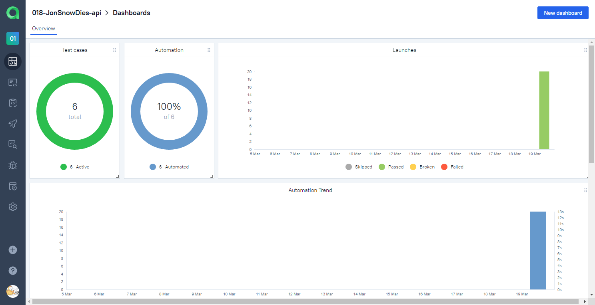
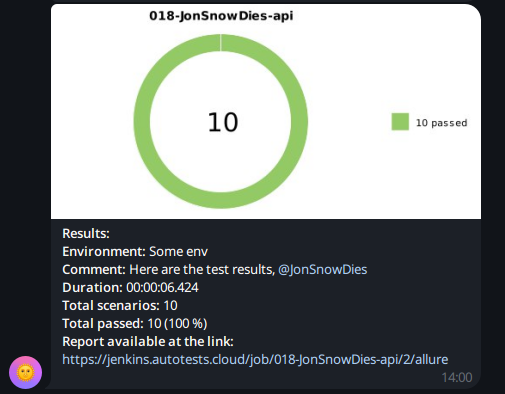

## Automated REST API tests for [shop.bugred.ru](http://shop.bugred.ru/)

<p>
  
</p>

## Content

- [Stack of technologies](#stack-of-technologies)
- [Description](#description)
- [List of REST API tests](#list-of-ui-tests)
- [Executing tests through the command line](#executing-tests-through-the-command-line)
- [Running tests in Jenkins](#running-tests-in-jenkins)
- [Test results report in Allure Report](#test-results-report-in-allure-report)
- [Allure TestOps integration](#allure-testops-integration)
- [Jira integration](#jira-integration)
- [Telegram notifications](#telegram-notifications)

---

## Stack of technologies

<div style="text-align: center;">


</div>

---

## Description

This test project consists of REST API tests and includes the following features:

- **Parameterized tests**: Enables the testing of diverse scenarios through the provision of varied input data
- **Request specification**: Streamlines and centralizes API test configuration
- **Object serialization/deserialization**: Facilitates seamless data transformation for API requests and responses using the `Jackson` library.
- **Comprehensive Test Reporting and Analytics**: Integration with `Allure TestOps` for robust test reporting and
  in-depth analytical insights
- **Test Data Generation**: Utilizing the `Faker` library to generate realistic and randomized test data inputs

[Back to top](#content)

---

## List of REST API tests

### Item creation

- Create an item in the shop with all fields set
- Create an item in the shop with only required fields set
- Test unsuccessful item creation by omitting a required parameter
- Attempt to create an item with a photo exceeding 500px in width.

### Item deletion

- Delete an item from the shop
- Attempt to delete an item with an invalid or non-existent ID

[Back to top](#content)

---

## Executing tests through the command line

To run tests through the command line using Gradle, you can use the following commands:

```bash
gradle clean test
```

[Back to top](#content)

---

## Running tests in [Jenkins](https://jenkins.autotests.cloud/job/018-JonSnowDies-api/)

Main page of the build:
<div style="text-align: center;">
  
</div>

Job configuration:
<div style="text-align: center;">
  
</div>

[Back to top](#content)

---

##  Test results report in [Allure Report](https://jenkins.autotests.cloud/job/018-JonSnowDies-api/2/allure/)

<code><strong>Allure Report</strong></code> overview page:

<div style="text-align: center;">
  
</div>

<code><strong>Allure Report</strong></code> behavior page:
<div style="text-align: center;">
  
</div>

[Back to top](#content)

----
## [Allure TestOps](https://allure.autotests.cloud/launch/37254) integration

<code><strong>Allure TestOps</strong></code> dashboard page:
<div style="text-align: center;">
  
</div>

<code><strong>Allure TestOps</strong></code> test cases page:
<div style="text-align: center;">
  
</div>

[Back to top](#content)

----
## [Jira](https://jira.autotests.cloud/browse/HOMEWORK-1168) integration

<div style="text-align: center;">
  
</div>

[Back to top](#content)

----
## Telegram notifications

After passing the tests, a report can be sent to <code>Telegram</code> messenger.

<div style="text-align: center;">
    
</div>

[Back to top](#content)